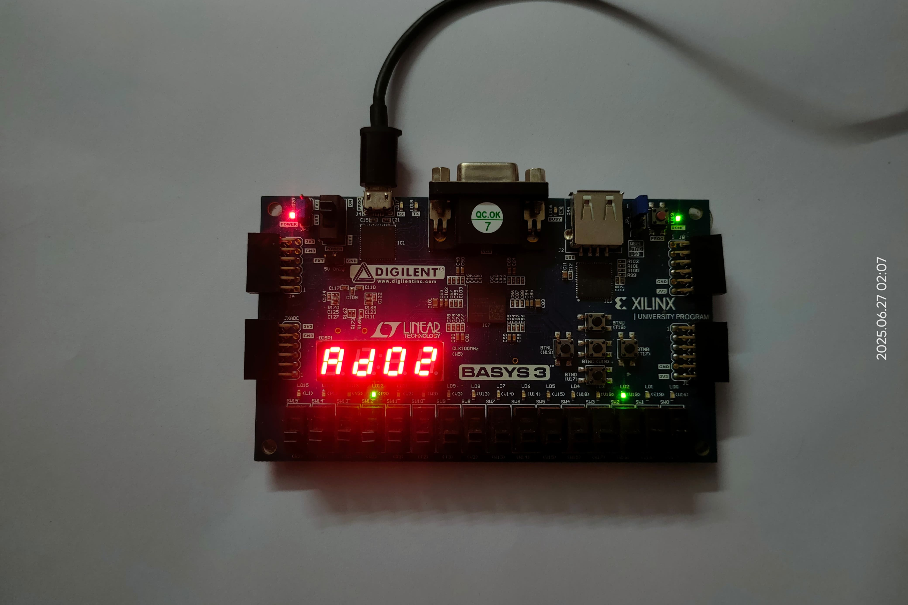

# Single-Cycle RISC-V RV32I Core

This repository contains a fully synthesizable **single-cycle RISC-V RV32I processor** core, implemented from scratch in Verilog. The design adheres to the base 32-bit integer instruction set (RV32I) defined by the RISC-V specification.

---

## Features

- Implements the full **RV32I** instruction set
- **Single-cycle execution** — each instruction completes in one clock cycle
- Written in **Verilog HDL**
- Modular design (datapath, control unit, ALU, register file, etc.)
- Compatible with **FPGA synthesis** (tested on Xilinx Basys 3)
- Sample instruction memory initialization file and programs included
- Simple **testbench setup** for simulation

---

## Basys 3 Implementation

This processor has been successfully implemented on the **Basys 3 FPGA board**. Key features of the FPGA implementation include:

- Hardware-mapped **seven-segment display** showing PC value or debug data
- Use of onboard **switches and buttons** for:
  - Reset (`W16`)
  - Clock enable (`V15`)
  - Memory/Register debug scrolling via BTNU, BTND, BTNL, BTNR, BTNC
- Real-time **debug interface**:
  - View memory and register contents
  - Switch between address and data view
  - Program completion detection (via `EB` display and LED on pin `P3`)
- Execution status is visualized:
  - Clock pulse indicator via `U19` LED
  - LED indicators for program end and debug mode

📖 **For step-by-step usage instructions and debug mode operation, refer to the `RISCV_Scroll_Menu_Manual.txt` in this repository.**

---

## Architecture Overview

The single-cycle processor executes one instruction per clock cycle. It includes the following modules:

- **Instruction Memory**: ROM holding preloaded `.hex` instructions
- **Program Counter (PC)**: 32-bit counter pointing to current instruction
- **Control Unit**: Generates control signals based on the opcode
- **Immediate Generator**: Extracts and sign-extends immediates
- **Register File**: 31 general-purpose registers (`x1`–`x31`) and 2 Special registers(`x0`–`PC`)
- **ALU**: Performs arithmetic and logical operations
- **Data Memory**: For load and store operations
- **Write-back Logic**: Returns ALU or memory result to registers

---

## Prerequisites

- **Vivado** (for simulation, synthesis and FPGA deployment)
- **RISC-V toolchain** (optional, for compiling test programs)

---

📘 **For a detailed explanation of the architecture, dataflow, and control logic, refer to [`RISC-V.pdf`](./RISC-V.pdf)**  
📘 **To operate the processor on Basys 3 hardware, see the [`RISCV_Scroll_Menu_Manual.txt`](./RISCV_operation_mannual_BASYS3.txt) file.**
